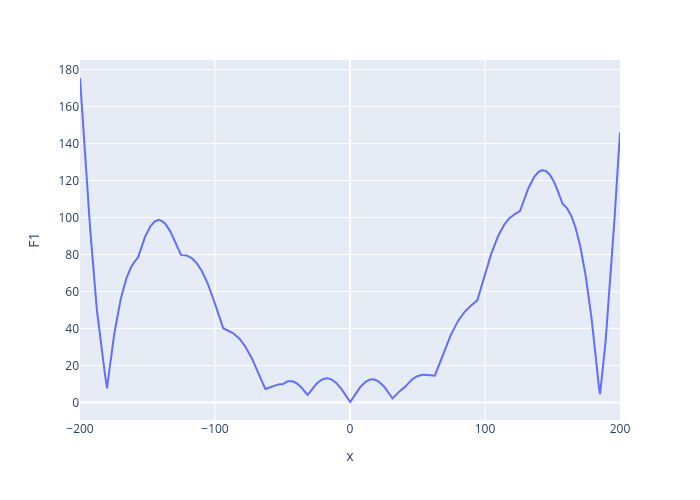

# Optimization 101: single-objective, single-parameter setup

This first tutorial serves as a fast-paced discovery of the most prominent benefits of Bayesian Algorithms while providing an opportunity to get familized with `foamBO`'s configuration mechansims.

The main objective is to **fit a Gaussian Process (surrogate model)** to the `F1` function from [New Benchmark Functions for Single-Objective Optimization Based on a Zigzag Pattern](https://ieeexplore.ieee.org/stamp/stamp.jsp?tp=&arnumber=9684455) paper, with parameters `k=1, m=0, lambda=0.01`.



<!-- mtoc-start:f93008a -->

* [Prerequisites](#prerequisites)
* [Use foamBO to fit a GP model on the F1 curve](#use-foambo-to-fit-a-gp-model-on-the-f1-curve)
  * [The YAML configuration](#the-yaml-configuration)
  * [The OpenFOAM case folder](#the-openfoam-case-folder)
  * [Generating predictions from models trained with foamBO](#generating-predictions-from-models-trained-with-foambo)
* [More advanced configuration tweaks](#more-advanced-configuration-tweaks)

<!-- mtoc-end:f93008a -->

## Prerequisites

- [x] No OpenFOAM installation is needed.
- [ ] You only need the `foamBO` CLI and a few Python dependencies to compute `F1` values
  - You can get the `foamBO` binary simply with `uvx foamBO` if [uv](https://github.com/astral-sh/uv) is installed, otherwise `pipx` does the trick.
  - Look at the top of [benchmark.py](/examples/single-objective/benchmark.py) for the rest of needed packages

If you are curious about how the Bayesian Algorithm works internally, there is a short overview at [this talk](https://foamscience.github.io/mma-seminar-byes-opt-presentation/). The presentation uses the same `F1` function to illustrate the different stages of the algorithm.

## Use foamBO to fit a GP model on the F1 curve

The [single-objective](/examples/single-objective) folder provides a complete example showcasing the different components needed to perform a Bayesian Optimization with `foamBO`:
1. The YAML configuration file; generate one with `uvx foamBO --generate-config --config myOpt.yaml`
1. Empty folders: `artifacts` and `trials` (these can be placed arbitrarily)
1. A way to compute objectives; in this case, the [benchmark.py](/examples/single-objective/benchmark.py) script
   - In read-world CFD scenarios, this step is split into two:
     - **Simulation Run** by providing a command to run the trial case. Progress of the metrics and job status are then tracked for early-stopping purposes.
     - **Metric computation** by providing commands to evaluate the case on an already-complete case.
   - But for the purposes of this tutorial, these are merged into a single script as no "case" is realy needed
1. The "OpenFOAM" case to use as a template for trials. In this case, we use a shell case with only an `FxDict` dictionary which holds the `x` value (which is our single parameter).

### The YAML configuration

The configuration file needs to contain a few sections:
1. `experiment` to configure experiment meta-data and the parameter space
1. `trial_generation` to configure the way "new trials are generated"
1. `existing_trials` to load data for pre-existing trials if any
1. `baseline` to promote a specific parameter set as a "baseline" for the analysis routines
1. `optimization` to configure objectives, metrics, how there are computed, and how to handle
   the template case.
1. `orchestration_settings` to configure experiment trials management, including timeouts, stopping strategies, and early-stopping
1. `store` to configure how to store/load the experiment data for restarts.

The configuration for this problem might look like this:

> [!IMPORTANT]
> Detailed documentation on configuration options, and more, can be accessed with:
> ```bash
> uvx foamBO --docs
```

```yaml
version: 1.1.0 # FoamBO version this is supposed to run with
experiment:
  name: SingleObjF1
  description: Demonstration of single-parameter single-objective optimization
  parameters:
  - name: x                  # Our single parameter, from -100 to 200
    bounds: [-100.0, 200.0]
    parameter_type: float
  parameter_constraints: []
trial_generation:            # Automatic trial generation
  method: fast               # Center-of-domain -> A few random ones -> BOtorch
existing_trials:
  file_path: ''              # No pre-existing trial data
baseline:
  parameters: null           # No baseline
optimization:
  metrics:
  - name: F1                 # Our F1 function value
    progress: null
    # this command will always run in CWD = Trial PWD
    # ./trials/<EXP_NAME>_trial_<HASH> relative the folder where the YAML config is
    command: "python3 ../../benchmark.py  --F F1 --k 1 --m 0 --lb 0.01"
  objective: -F1             # Objective is to minimize F1 metric
  outcome_constraints: []
  case_runner:
    template_case: ./case    # Folder name for OpenFOAM case to use
    mode: local
    runner: null             # Command to run the trial (not needed here)
    log_runner: false
    remote_status_query: null
    remote_early_stop: null
    trial_destination: ./trials    # Where to put new trials
    artifacts_folder: ./artifacts  # Where to put JSON states and HTML reports
    file_substitution: []
    variable_substitution:
    - file: /FxDict                # How to substitute x value in case dictionaries
      parameter_scopes:
        x: x
orchestration_settings:
  max_trials: 50                   # Run for at most 50 trials
  parallelism: 3                   # 3 at the same time
  initial_seconds_between_polls: 10
  seconds_between_polls_backoff_factor: 1.0
  timeout_hours: 24                # in hrs, for the whole experiment
  ttl_seconds_for_trials: 10       # in secs, for a single trial
  global_stopping_strategy:        # When to stop
    min_trials: 10
    window_size: 5
    improvement_bar: 0.1
  early_stopping_strategy: null
store:
  save_to: json
  read_from: nowhere
  backend_options:
    url: null
```


### The OpenFOAM case folder


As for the OpenFOAM [case](/examples/single-objective/case), it only has a single dictionary [case/FxDict](/examples/single-objective/case/FxDict) with the content:
```cpp
FoamFile
{
    version     2.0;
    format      ascii;
    class       dictionary;
    object      FxDict;
}
// benchmark.py has to read this value as it's "x"
x 0; // this is where the x value suggested by the BO algorithm will be replaced
```

### Generating predictions from models trained with foamBO

`foamBO` will periodically save your experiment to a JSON file (or an SQL database). You can load the latest state again into an Ax client:
```python
# This script must run with CWD = folder where YAML configuration is located
from foambo.common import *  # * is important here
from foambo.orchestrate import StoreOptions
set_experiment_name("SingleObjF1")  # Has to be the same experiment.name from YAML config 
store = StoreOptions(read_from="json", save_to="json", backend_options={})
client = store.load()
client.predict([{'x': 10}, {'x': 100}])
```
```
# Format: (mean, SEM)
[{'F1': (np.float64(6.647145730499645), np.float64(2.3754714352336928))},
 {'F1': (np.float64(76.3935824225102), np.float64(5.730590491967466))}]
```

Observe that the surrogate model deteriorates in fidelity the further we are from the actual minima.
To train a more accurate surrogate model, one can force a larger number of trials (`max_trials: 300`) with unrealistic stopping `window_size: 300`. Note that running the optimization again with the following arguments is enough (this will continue from existing trials):
```bash
uvx foamBO --config myOpt.yaml \
    ++store.read_from=json \
    ++orchestration_settings.max_trials=300 \
    ++orchestration_settings.global_stopping_strategy.window_size=300
```

`foamBO` CLI supports overriding the YAML configuration through `++|keyword|=|value|` syntax; where values are parsed with `PyYAML`'s safe loaders. So `1.0e-4` will be parsed as a "float" whereas `1e-4` will be seen as a "string".

Users can also use the custom tags supported by the YAML configuration reader as CLI arguments; notably:
- `++my_list='!range [1, 10, 2]'` will send in a Python list `[1, 3, 5, 7, 9]` as the value for `my_list` entry. This has the same behavior as Python ranges and the step can be omitted if it is 1.

---

## More advanced configuration tweaks

Users are recommended to play around with the configuration and explore how these affect the outcome:

1. Setting a baseline:
   ```bash
   uvx foamBO --config myOpt.yaml ++store.read_from=nowhere ++baseline.parameters.x=100.0
   ```
   A few things that are worth taking notes of compared to no-baseline run:
   - The baseline is now shown clearly in analysis cards.
   - Was setting a baseline helpful in cutting down on trial count needed for convergence?
1. Setting an outcome constraint after adding another metric (Obviously, this works only in Multi-objective context):
   ```bash
   uvx foamBO --config myOpt.yaml ++store.read_from=nowhere \
       ++optimization.outcome_constraints='["F1 <= 60"]'
   ```
   As a rule of thumb; set the constraint to 10% above the value you think is a reasonable bound. You can even use the baseline value for this by setting the constraint string to: `"F1 <= 1.1*baseline"`
3. Explore `artifacts/SingleObjF1_report.csv` to see how many trials where needed for initialization (Center+Sobol generation nodes) and how many were actually suggested by the BoTorch algorithm.
