# Multi-objective optimization: advanced setups

The main objective of this tutorial is to dive deeper in `foamBO` capabilities, especially when it comes to analyzing results for multi-objective experiments, as well as its orchestration capabilities such as integrating with a SLURM-based cluster.

> [!IMPORTANT]
> Don't forget that you can consult more detailed configuration docs with:
> ```bash
> uvx foamBO --docs
> ```

<!-- mtoc-start:2125fb2 -->

* [Multi-objective optimization: advanced setups](#multi-objective-optimization-advanced-setups)
  * [Prerequisits](#prerequisits)
  * [General workflow](#general-workflow)
  * [Problem setup](#problem-setup)
    * [General intentions](#general-intentions)
    * [Metric/objective crafting](#metricobjective-crafting)
  * [Optimization setup](#optimization-setup)
  * [Optimization study results](#optimization-study-results)
    * [Cross Validation: Assessing model fit](#cross-validation-assessing-model-fit)
    * [Tradeoffs between objectives: Pareto frontier](#tradeoffs-between-objectives-pareto-frontier)
    * [Did the optimization cover enough of the search space?](#did-the-optimization-cover-enough-of-the-search-space)
    * [Effects of parameter values on objectives](#effects-of-parameter-values-on-objectives)
    * [Top surface analysis: Parameter sensitivity](#top-surface-analysis-parameter-sensitivity)

<!-- mtoc-end:2125fb2 -->

## Prerequisits

- [x] Although not necessary, a SLURM cluster might prove useful. You can use this [makeshift-setup].
   - The `/tmp/data` path will be set to share things with the cluster from your host machine.
- [x] To ease portability, an OpenFOAM installation with headless-Paraview in an apptainer container form is required
   - You can easily create one using [openfoam-apptainer-packaging] (requires ansible and apptainer):
     ```bash
     cd examples/multi-objective/apptainer
     git clone https://github.com/FoamScience/openfoam-apptainer-packaging /tmp/of_tainers
     ansible-playbook /tmp/of_tainers/build.yaml \
                      --extra-vars "original_dir=$PWD" --extra-vars "@container.yaml"
     ```
   - You'll then find the container at
     `examples/multi-objective/apptainer/containers/projects/openfoam-paraview*.sif`
   - Copy this file to `/tmp/data/openfoam-paraview.sif` since the case scripts expect it to be there
- [x] Copy the management scripts too: `cp examples/multi-objective/scripts /tmp/data/scripts`

## General workflow

Here is the central optimization workflow `FoamBO` was designed around:

---

1. Prepare a working OpenFOAM case.
   - Have a script to execute the full pipeline of the case (pre-processing, running, post-processing)
   - Have scripts to compute metrics (ideally from logs, or with quick calculations)
   - If the case is to be running on a cluster, have scripts that can consult job status and can cancel the jobs
1. Generate a YAML configuration for your problem
   - `uvx foamBO --generate-config --config MyOpt.yaml` will get you a default configuration
   - `uvx foamBO --docs` will help you discover what settings do and which settings you need
1. Start the optimization run
   - `uvx foamBO 2>&1 | tee log.foamBO`
4. At any point during the optimization, you can analyze the current state
   - `uvx foamBO --analysis --config MyOpt.yaml ++store.read_from=json` (if the experiment is being saved to JSON files)
   - This will write HTML reports to `<artifacts-folder>`
   - Most analysis reports are only meanignful if the current model is a Bayesian optimizer (not, for example, SOBOL which will generate the few first trials randomly)
   - At the end of the optimization, these HTML reports will be also be written to the same folder
   - The artifacts folder will also have a CSV report on current trials and their metric values

---

Generally speaking an optimization folder will look like this:
```bash
.
├── artifacts                  # can have an arbitrary path, for reports
├── theBaseCase                # can have an arbitrary path, for the OpenFOAM case
├── trials                     # can have an arbitrary path, for trials
└── MyOpt.yaml                 # configuration file, must be in the folder where foamBO runs
```

In this tutorial:
- We introduce an apptainer container to make it easier to switch between local and remote (SLURM-based) case execution
- For the slurm cluster, a [makeshift-setup] is suggested; and the trials will be in `/tmp/data/trials`

## Problem setup

### General intentions

We want to leverge Bayesian Optimization as a means to extract physical insights about lid-driven cavity flows.
Can we improve on OpenFOAM's standard tutorial configuration to deliver more interesting physics while keeping the computational cost down?

1. **Understand parameter sensitivity and flow response:**
   - Quantify how changes in lid velocity, kinematic viscosity, inflow perturbations, and mesh refinement affect key flow features such as wall shear stress and rotational energy.
   - Identify which parameters dominate flow dynamics in different regimes (e.g., low vs. moderate Reynolds numbers).
1. **Explore flow regimes efficiently:**
   - Discover combinations of parameters that lead to extreme or unusual flow patterns, such as unusually strong vortices, or near-laminar-to-transitional behaviors, without brute-force scanning the parameter space.
1. Develop quantitative design rules
   - Use surrogate models to predict outcomes for untested parameter combinations.
   - Extract approximate functional relationships between flow metrics and parameters, which can guide physical reasoning.
1. Assess robustness and sensitivity to perturbations
   - Study how small disturbances (in inflow, lid velocity, or viscosity) affect flow metrics.
   - Provide insight into flow stability and the physical tolerance of the system to variations.

### Metric/objective crafting

To create a well-posed multi-objective optimization problem - that would'nt reduce to a single-objective one - metrics should conflict physically or numerically:
1. A metric rewarding CFD solution quality and accuracy
1. one rewarding computational cost
1. a few metrics capturing different aspects of the flow, so we're not optimizing a bunch of highly-correlated aspects of a flow feature.

Bayesian Optimization is actually a decent to decide on what objectives really matter! but this is beyond the scope of the tutorial, so we just take a shot in the dark with:

1. Continuity errors:
   - Most simple solution quality metric. However, as this metric evolves as the simulation progress, it's usually better to leverage it as an early-stopping criterion rather than an optimization objective.
   - Think: Stop all trials that perform worse than 25% of other trials at any simulation-time point.
4. Execution time:
   - Most simple computational cost metric.
   - This one serves as a counter for high mesh resolutions, and poor choice of linear solver settings.
1. Enstrophy:
   - An integral measure of small-scale rotational energy
   - Tends to cost higher execution time if maximized
1. Wall shear stress:
   - A physics axis at the moving wall, different from bulk-vorticity

## Optimization setup

The parameter space is chosen in a way that stays close to the original setup:
- Incompressible fluids with reasonable moving wall velocities
- Laminar flow is enforced through parameter constraints, although this can be enforced simply through parameter ranges
- The moving wall's velocity is perturbed a little bit with a sinusoidal signal

To make the simulations last a little longer, a mesh resolution and a CFL controller are added to the parameter space. This is done mostly toshowcase the early-stopping capabilities.

As a last set of parameters, we have picked some linear solver settings to showcase the importance of conveying parameter dependency relationships to the Bayesian Algorithm. To start, we ignore these relationships:

> Typically, you would split these sets of parameters to distinct optimization studies, assuming there is no interaction between them.

```yaml
experiment:
  parameter_constraints: ["lidVelocity <= 20000 * viscosity"] # laminar-only trials
  parameters:
  - name: viscosity
    bounds: [1.0e-7, 1.0e-3]
    parameter_type: float
  - name: lidVelocity
    bounds: [1.0e-3, 2.0]
    parameter_type: float
  - name: inflowPerturbationAmplitude
    bounds: [0.0, 0.03] # fraction of lidVelocity
    parameter_type: float
  - name: inflowPerturbationSpatialMode
    bounds: [3, 8]
    parameter_type: int
  - name: meshResolution
    bounds: [2, 3]
    step_size: 1
    parameter_type: int
  - name: meshCFL
    bounds: [0.5, 1.0]
    parameter_type: float
  - name: pLinearSolver
    values: ["FPCG", "PBiCGStab", "PCG", "PPCG", "PPCR"]
    is_ordered: True
    parameter_type: str
  - name: pPreconditioner
    values: ["DIC", "FDIC", "diagonal", "distributedDIC", "none"]
    is_ordered: True
    parameter_type: str
  - name: pTolerance
    bounds: [1.0e-6, 1.0e-4]
    scaling: log
    parameter_type: float
  - name: pRelTolerance
    bounds: [0.01, 0.1]
    scaling: log
    parameter_type: float
  - name: UTolerance
    bounds: [1.0e-5, 1.0e-3]
    scaling: log
    parameter_type: float
```

When it comes to how to generate the next trials, it's recommended to let the algorithm decide on its own. Usually, it'll start with the Center of the domain, do a few random guesses (`SOBOL`) and then switch to a `BOTorch` strategy; Although this depends on the search space and objectives configuration.

Setting up metrics and objectives is as easy as:

> [!IMPORTANT]
> These metric commands should output either:
> - a `scalar`
> - or `mean, sem`
> The trial's progression step is supported in "progress" commands with `$STEP`
>
> Note that it's good practice to have the progress scripts be:
> - lightweight, as they are executed each time the algorithm polls for trial completion
> - robust, outputing `nan` if information is not available yet

```yaml
optimization:
  metrics:
  # This metric is NOT an objective, used only to early-stop bad trials
  # lower_is_better helps define what "bad trial" mean
  - name: continuityErrors
    command: [ "/tmp/data/scripts/metric.sh", "local", "continuityErrors" ]
    progress: [ "/tmp/data/scripts/metric.sh", "local", "continuityErrors" ]
    lower_is_better: True
  - name: executionTime
    command: [ "/tmp/data/scripts/metric.sh", "local", "executionTime" ]
    progress: [ "/tmp/data/scripts/metric.sh", "local", "executionTime" ]
    lower_is_better: True
  - name: wallShearStress
    command: [ "/tmp/data/scripts/metric.sh", "local", "wallShearStress" ]
    progress: []
  - name: enstrophy
    command: [ "/tmp/data/scripts/metric.sh", "local", "enstrophy" ]
    progress: []
```

```yaml
optimization:
  # negative sign means: minimize the metric
  objective: "enstrophy, -wallShearStress, -executionTime"
```

In this case, the algorithm is instructed to maximize rotational energy while minimizing execution time and wall shear stress.

The continuity errors are not used as an objective, but they are useful to track in case a trial starts to produce inaccurate results, which early-stops any trials that behave irregularly. Make sure `lower_is_better` is set on these metrics so the early-stopping strategy knows whatto consider as "bad trials".

**Local/Remote modes for case dispatching:**

The provided [MOO.yaml] configuration supports two modes when it comes to running the trials:
1. A "local" mode, where trial cases run locally (tracking PIDs of related processes), along with the metrics.
1. A "remote" mode where trial cases run as SLURM jobs, which then requires the user to specify how to query
   for job completion, as well as how to stop jobs (if early-stopping is configured).

> [!IMPORTANT]
> - All commands specified under `optimization.case_runner` and `optimization.metrics` sections will run **locally** with a CWD that is set to to the trial's path, regardless of the chosen mode.
> - If remote execution is desired, it must be handled by the running command, however, metric commands are **blocking ops**; they must return a value when called, so, users can use `srun` to compute their metrics, but this is not recommended.
>   Instead, move the heavy lifting to the `runner` script, and only consult logs in metric commands.

The provided cavity case and associated scripts, of course, are ready to support both modes.

The related configuration entries are under the optimization section:
```yaml
optimization:
  case_runner:
    template_case: ./cavity
    mode: remote # or: local
    runner: "/tmp/data/scripts/run_on_cluster.sh" # or: ./Allrun /tmp/data/openfoam-paraview.sif
    remote_status_query: "/tmp/data/scripts/state_on_cluster.sh" # optional, only if mode=remote
    remote_early_stop: "docker exec slurm-head scancel --name $CASE_NAME" # also optional
```


In this case, because we are sharing `/tmp/data/trials` between the host and the Docker-based cluster, we can compute metrics locally or remotely.


**Improvement-based global stopping stategy:**
Stops coming up with new trials once the improvement in best observed objective over `n` consecutive trials becomes less than an `bar * IQR` where `IQR` is the interquartile range of observed objectives, and `bar` is a user-supplied setting:
```yaml
orchestration_settings:
  global_stopping_strategy:
    improvement_bar: 0.1
    min_trials: 30
    window_size: 10
```

**Trial-based early stopping:**
To save on resources, and to penalize harmful trials (eg. with inaccurate results), there is an option to early-kill trials if they prove to be not interesting enough for our objectives.

The `ax-platform` backend provides two strategies for this, one is percentile-based, the other is threshold-based, and a couple of ways to combine them:
```yaml
orchestration_settings:
  early_stopping_strategy:
    type: or
    left:
      type: percentile
      metric_names: [ "continuityErrors" ]
      min_progression: 2
      percentile_threshold: 25
      trial_indices_to_ignore: !range [0, 30]
    right:
      type: percentile
      metric_names: [ "executionTime" ]
      min_progression: 2
      percentile_threshold: 10
      trial_indices_to_ignore: !range [0, 30]
```

Acording to the above configuration, the orchestrator will start looking at all feasible trials once they reach their second progression step (`min_progression`), compare trial metrics, and if one performs worse than the percentile threshold set, the trial is early-stopped.

> "Worse" here is defined by `lower_is_better` metric propriety:
> - True will try to stop the trial with metric values higher than 25% of other trials
> - False will try to stop the trial with metric values lower than 25% of other trials

Users can protect the intial trials from sudden early-stopping with a custom YAML constructor: `!range [0, 30]` having the same signature and behavior as Python ranges (so this will protect the first 30 trials with IDs 0-29).

The progression step is increased basically each time the algorithm polls for trial completion, which is controlled by `orchestration_settings.initial_seconds_between_polls` and `orchestration_settings.seconds_between_polls_backoff_factor`.

> [!NOTE]
> The progress commands should return an aggregate value, like **cummulative continuity errors**, ideally, something that follows a monotonic trend over time. Execution time is a good example.
> Coupling the `$STEP` to simulation-time is a plausible idea, however, it must be handled by the progress commands on their own for now.

For the full optimiztion configuration, consult the [MOO.yaml] file.

## Optimization study results

This section showcases sample results from an optimization run for up to 80 trials, which the improvement-based strategy stops at around 70 trials. The reports reside in the `artifacts` folder.

As a side note, the simulations were too fast to have per-progression data, and no trials were early-stopped, so we omit related insights here.

### Cross Validation: Assessing model fit 

The overview report (`artifacts/<experiment-name>_overview_of_the_entire_optimization_process.html`) will have cross-validation information as its last section:

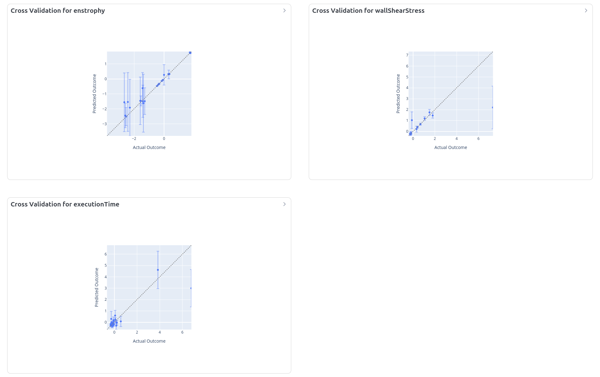

As long as we don't see a flat horizontal line of predictions, it means the model has picked up some kind of signal in the data. But for our case, the model has fitted reasonable to all objectives; enstrophy having the least confidence.

Another interesting measure of model quality is the trend the Hyper-Volume follows:

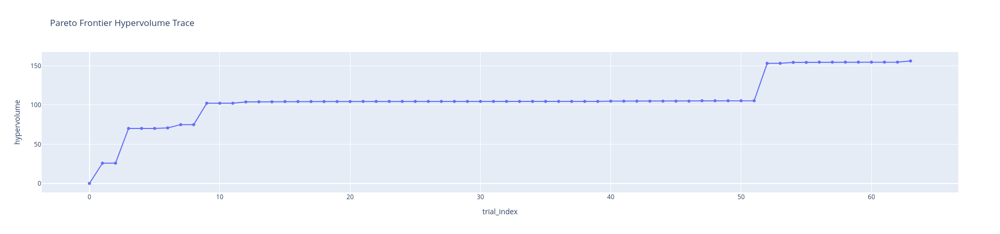

The flat regions of hyper-volume curve indicate no improvement in the Pareto Frontier, but near the end of the optimization, there is a slight HV increase, which suggests a smaller improvement bar will probably produce a better fit.

### Tradeoffs between objectives: Pareto frontier

The Paretor frontier shows parameter sets that strike a balance between each two objectives. Changing the parameter values will worsen either objective.

It is sensitive to the outcome constraints as the algorithm will try to focus on the regions within constraints; but from the corresponing report, we can derive some insights:
- As the flow is laminar we see no effect of enstrophy on wall shear stress. The WSS is **probably** dominated by lid velocity, and the bulk's vorticity seems to play a minor role here; so **we can improve enstrophy** without affecting WSS much.
- The same holds for execution time not affecting WSS, as apparently we can run faster simulations but still recover the WSS.

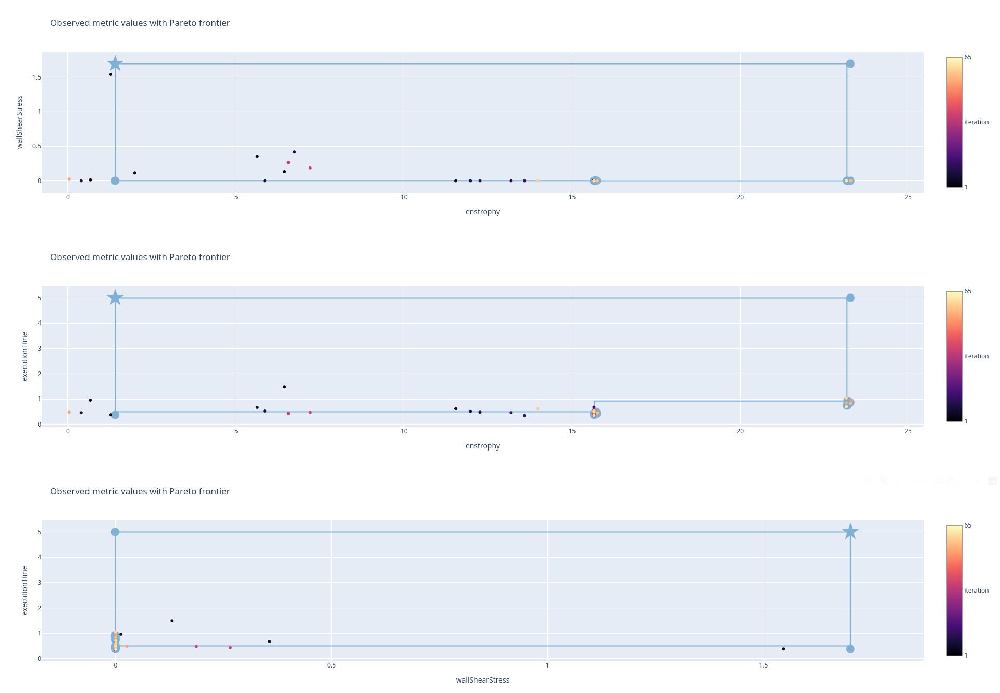

### Did the optimization cover enough of the search space?

The following parallel coordinate plots show the BO algorithm chooses parameter values:

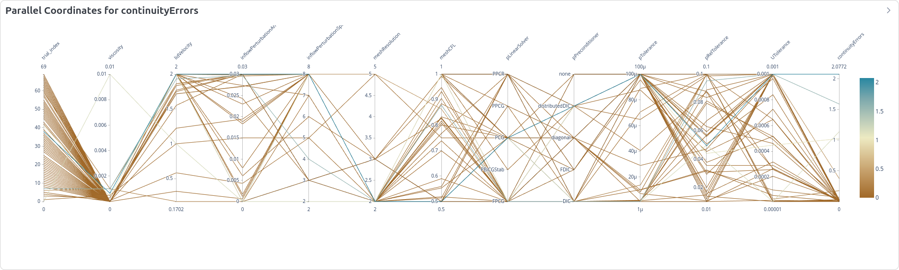
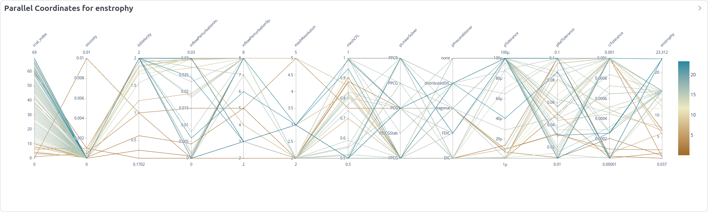
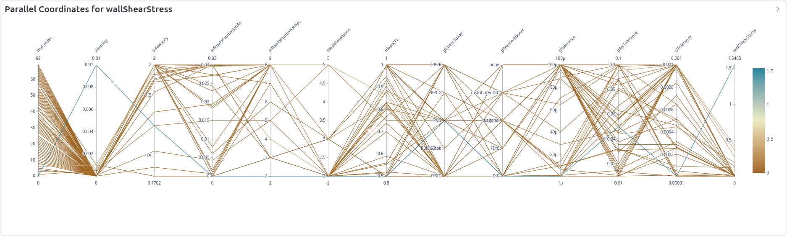
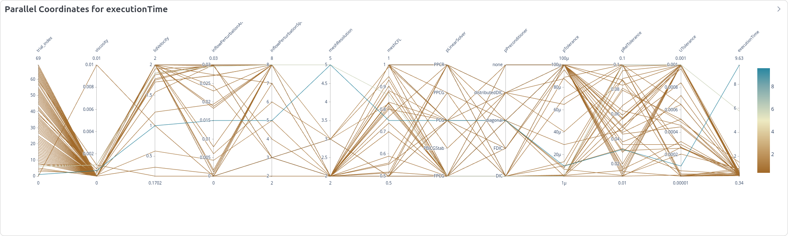

It's interesting that the algorithm desperately wanted to lower viscosity values (as we are maximizing enstrophy).

### Effects of parameter values on objectives

For the choice parameters, consulting their marginal effects on each objective can helpful in
- Clarify which values affect the metric positively (colored in cyan).
- Evaluating the surrogate model's interpretability, as they show how the model's predicted performance (objective value) changes with respect to a single input variable, marginalizing over the others.

This information can then be used to influence objectives from the Pareto frontier:

> [!IMPORTANT]
> These plots must be looked at in the context of the following sensitivity analysis

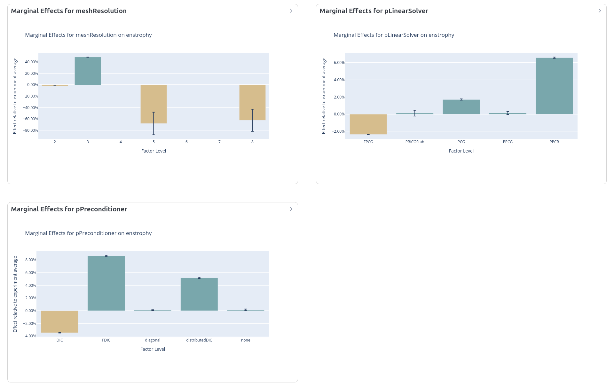
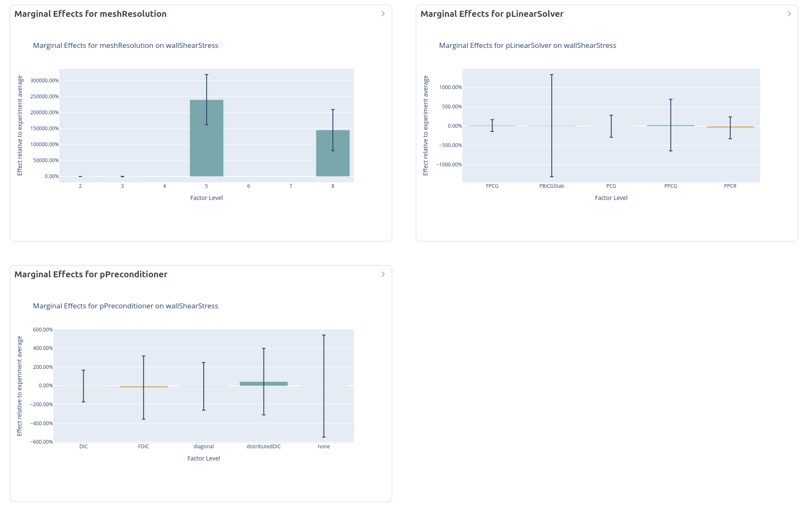
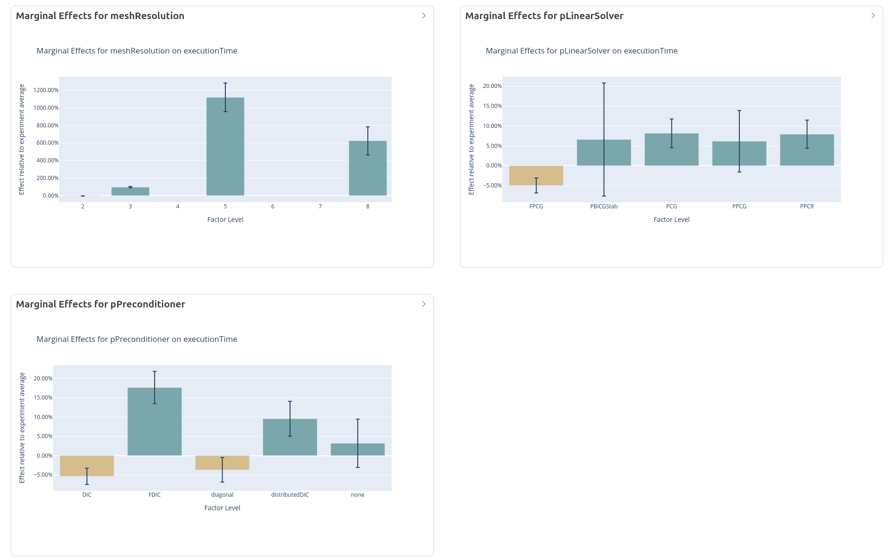

Some important observations:
- It makes perfect sense that linear solver settings have no effect on WSS 
- But the same two parameters (`pLinearSolver` and `pPreconditioner`) influence the execution time

The marginal effect plots seem to suggest `PCG solver with FDIC preconditioner at mesh resolution 5` to be the ideal parameter set. The case is decomposed to 2 domains, so maybe in addition to a raw execution time, we should have a scaling representation as another objective.

> [!NOTE]
> The previous statement is probably not entirely correct since we commited to considering the linear solver and its preconditioner as "independent" parameters...

### Top surface analysis: Parameter sensitivity

When it comes to influencing enstrophy; the algorithm thinks increasing fluid viscosity significantly worsens enstrophy!

> [!NOTE]
> This is to say, at low Reynolds numbers, viscous effects damp out vorticity and dominate enstrophy effetcts. This may mean the range of lid velocity needs to be extended into higher Re numbers to start influencing enstrophy!

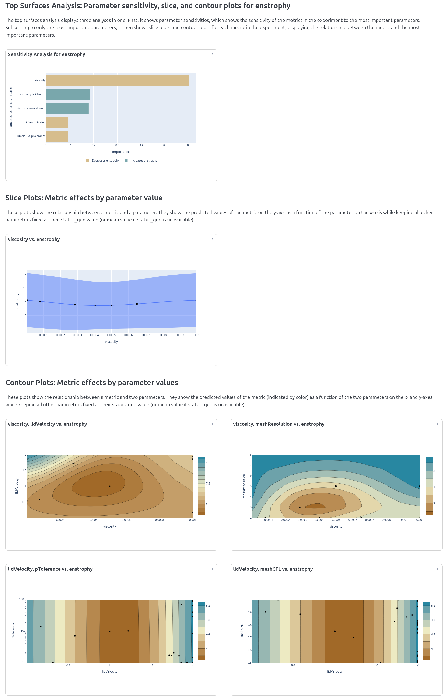

> [!NOTE]
> The same analysis can be applied to wall shear stress; with viscosity having the opposite effect.

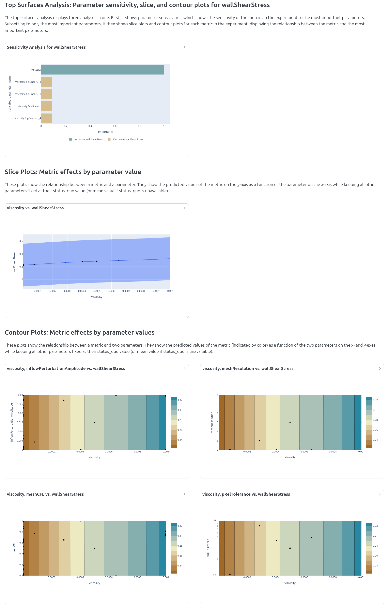

> [!NOTE]
> What influences execution time the most is clear; the mesh resolution. Courant number, again, doesn't make an appearance here because it doesn't restrict the time step length to the point where it becomes relevant, as velocity magnitudes are not that high.

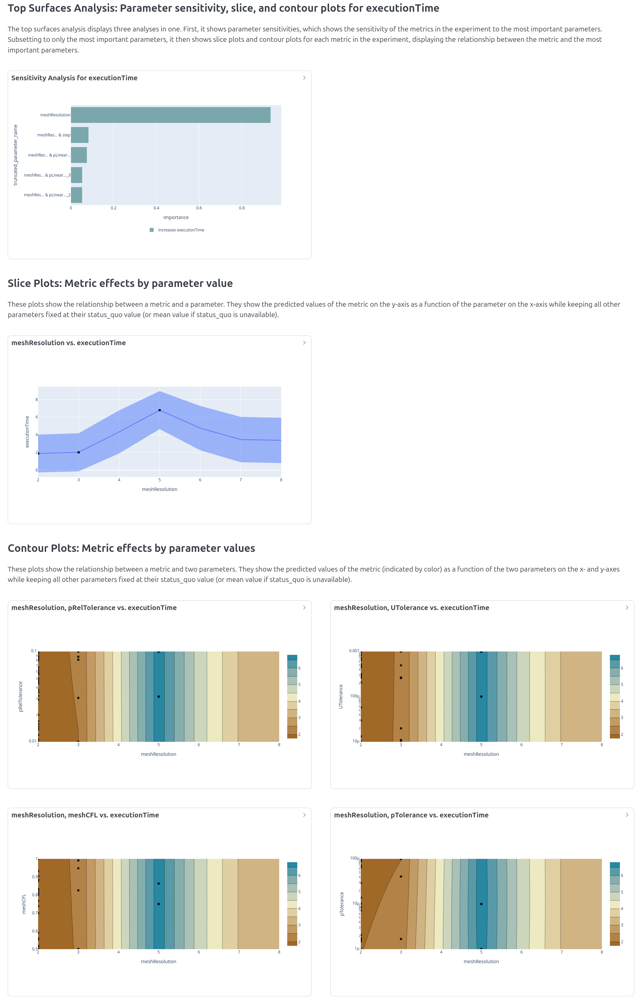

> [!NOTE]
> Even though conitnuity errors are not an objective, it's worth what can make the simulation instable/inaccurate. It turns out the perturbation in lid velocity can shake the solution accuracy at high viscosities! 

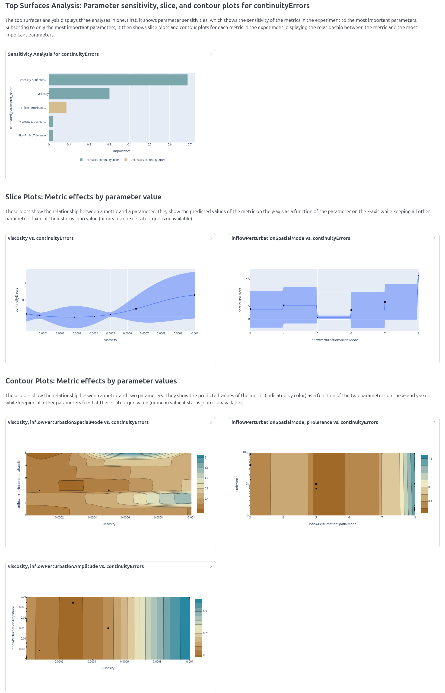


[makeshift-setup]: https://github.com/FoamScience/hpc-makeshift-cluster
[openfoam-apptainer-packaging]: https://github.com/FoamScience/openfoam-apptainer-packaging/pkgs/container/opencfd-openfoam
[MOO.yaml]: /examples/multi-objective/MOO.yaml
