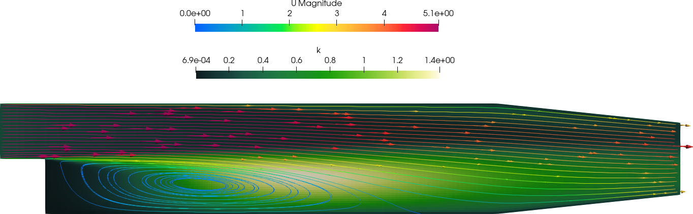
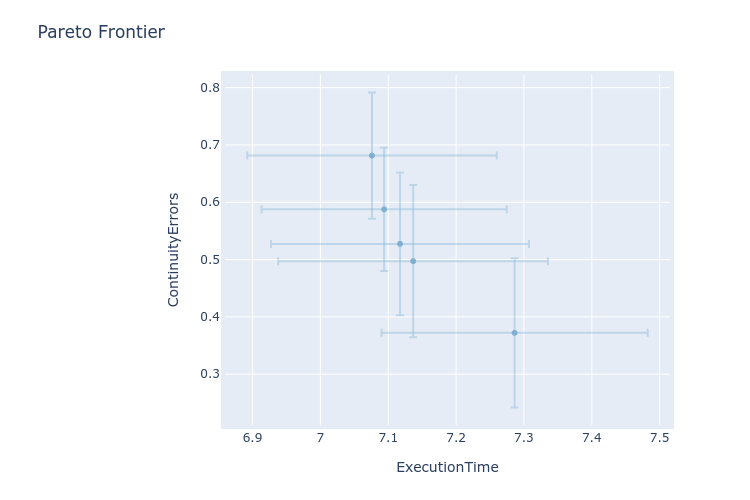

# Multi-objective High-Dimensional Bayesian Optimization on OpenFOAM cases (with SAASBO)

## Prerequisites

- You need the `foamBO` package: `pip install foamBO`
- You need an OpenFOAM version. Set `FOAMBO_OPENFOAM` to its installation folder.
  `${FOAMBO_OPENFOAM}/etc/bashrc` will be sourced in cases' `Allrun`.

- It's recommended to go through [Single-objective Optimization]{../single-objective/README.md}
  first

- Optionally, You will want a
  [recent version of docker-compose](https://docs.docker.com/compose/install/other/)
  if you want to use a containers-based SLURM cluster.

## Preface

This document describes how to use `foamBO` to run Fully-Bayesian optimization
(or just parameter variation studies) on OpenFOAM cases.

I describe the workflow in two cases:

1. Your OpenFOAM cases will run on a local machine, with at least 4 CPUs.
2. Your OpenFOAM cases will run on a SLURM-managed cluster. For this, I'm using a dummy cluster built on top of
   Docker (centOS) containers which have OpenFOAM 2206 installed from
   [here](https://github.com/FoamScience/docker-openfoam-slurm-cluster)

> If you're going with option 1, you can skip setting up the cluster. If you intend to adopt option 2, I
> recommend you still go through option 1
>
> This toolkit relies on [ax-platform](https://ax.dev) to do the optimization, so we support what they support + a few custom things.
>
> Here are few nice words about [Bayesian Optimization](https://ax.dev/docs/bayesopt.html). If you want to extend
> these tools, you might want to take a look at the [Service and Developer APIs](https://ax.dev/docs/api.html)

> Also, `foamBO`, `foamDash` and `validateBO` scripts are [Hydra Applications](https://hydra.cc/docs/intro/),
> so you can load different configurations
> and/or override config values from the command line.

## Features we're exploring

- Zero-code configuration for running parameter variations.
    - As long as you're able to do stuff through Bash.
- Unattended algorithm selection for the trial generation strategy and Bayesian optimization.
- Ease of use; especially for metric evaluation; it's just a --new Python function--.

## The example problem

To illustrate the somewhat complex workflow of running optimization studies with this toolkit, I picked
the `pitzDaily` case from the standard tutorials (the one that works with `simpleFOAM`/`RAS`). The case
can run both in serial and in parallel with 2 processors.



Our design variables are:
- Inlet velocity value.
- Initial internal value of `k` (the turbulent kinetic energy, as in `k-epsilon` turbulence model).

Our objectives are:
- Execution Time, extracted straight from the solver log files
- Continuity Errors, also extracted from log files

> Note that we are **not** particularly interested in the results of the study;
> All we care about is demonstrating how to optimize this problem with Bayesian algorithms.


## Setup the dummy OpenFOAM-ready SLURM cluster [Optional]

The dummy cluster will have:
- A head node (`axc-headnode`) where all operations should originate from.
- 4 compute nodes.
- Some extra nodes for database deployment, ..., etc that we don't care about for now.

In this example, we will try to stress it a little, where we spawn 3 jobs in parallel, each using
2 nodes (Although, you can always tweak this configuration).

> You will need a [recent version of docker-compose](https://docs.docker.com/compose/install/other/)
> for this to work

```bash
# Clone the repo
git clone https://github.com/FoamScience/docker-openfoam-slurm-cluster slurm-cluster
cd slurm-cluster
# Build containers; this might take some time, downloading and compiling stuff
docker-compose build
# Spin up the cluster containers
docker-compose up -d

# At this point, slurm-cluster/var/axc on your local machine is shared to /axc on all cluster nodes
# so let's clone the optimization toolkit there
git clone https://github.com/FoamScience/OpenFOAM-Multi-Objective-Optimization var/axc/multiOptOF

# Get shell access to the head node on the cluster
docker exec -it axc-headnode bash

# Make sure everything works fine (you should see 4 different IP addresses):
salloc -N 4 mpirun --allow-run-as-root hostname -I

# Source OpenFOAM
source /usr/lib/openfoam/openfoam2206/etc/bashrc
```

All subsequent operations are supposed to run on the head node.

## Install prerequisites

> If you don't want to use the cluster, please adapt the paths to your local machine.
> Don't forget to clone https://github.com/FoamScience/OpenFOAM-Multi-Objective-Optimization

The best option is to get [Miniconda](https://docs.conda.io/en/latest/miniconda.html) and:
```bash
# Remember /axc on the head node, would be slurm-cluster/var/axc on your machine
cd /axc/multiOptOF
conda create -n of-opt python=3.12 pip
conda activate of-opt
# This will install a load of packages
pip install foambo
```

## Local runs

The workflow consists of the following steps:
- Preparing your base case, this will be a fully-functional OpenFOAM case
- Writing a configuration file (YAML) for the optimization/parameter-variation
- Running `foamBO` in the directory containing the configuration file

The [example case](pitzDaily) is provided with the [example configuration](config.yaml)
for reference.

### Design parameters

The configuration file has at least four important sections:
- `problem`: where you describe your problem inputs
- `meta`: where you describe control settings for the optimization procedure
- `validate`: where you optionally configure how the cross-validation of fitted models should be performed by `validateBO`
- `visualize`: where you optionally configure how trials are visualized when you run `foamDash`

The first thing is `problem.template_case` which points to the case you want to use as a base template.
This case is then cloned each time with the help of PyFOAM. `meta.case_subdirs_to_clone` specifies
any non-standard folders/files to clone with the base case. Also, `meta.clone_destination` controls where
the case is copied to.

Next, we have `problem.parameters`. This is where you specify the type/values for your parameters.

> GenerationStrategy chooses parameter values **automatically**. You can't control what values will be 
> chosen unless you set your parameter type to "choice". The exact strategy is dictated by your search space
> properties. When running parameter variations; SOBOL is used for the whole number of trials.
>
> For a list of parameter types and options; check the different classes at: https://ax.dev/api/core.html#parameter
>
> Also, there is partial support for dependent parameters, mainly you need one root parameter (Ax limitation) ...

To describe **how** the parameters are substituted in the cloned case, `problem.scopes` specifies the files
and scope to dictionary entry corresponding to the design parameter.

```yaml
problem:
  template_case: 'pitzDaily'
  parameters:
    k:
      type: range
      value_type: float
      bounds: [0.1, 0.4]
      log_scale: False
    inletVelocity:
      type: range
      value_type: float
      bounds: [5.0, 20.0]
      log_scale: False
  scopes:
    "/0orig/U":
      inletVelocity: "inletVelocity"
    "/0orig/k":
      k: "k"
meta:
  case_subdirs_to_clone: ["0orig", "Allrun.slurm"]
  clone_destination: "/axc/OpenFOAM-Multi-Objective-Optimization/"
```

The snippet above says to replace `inletVelocity` entry in `0orig/U` with the value of `inletVelcity` parameter.

There is another way to do this that is more suitable to choice parameters. In the following example,
`constant/turbulenceProperties.RAS`, `constant/turbulenceProperties.LES` or `constant/turbulenceProperties.laminar`
will get copied to `constant/turbulenceProperties` depending on the chosen value of the `modelType` parameter.

```yaml
problem:
  parameters:
    modelType:
      type: choice
      value_type: str
      values: ["RAS", "LES", "laminar"]
      is_ordered: True
  file_copies:
    modelType:
      template: "/constant/turbulenceProperties"
```

Also note that this is done before any other substitutions, so, you can have other parameters in those files too.
This issue with that is it will skew your analysis because you're making those parameters dependent on `modelType`
without the proper treatment of dependent parameters in the algorithms.

As for dependent parameters, `ax-platform` only supports a single root parameter at the moment, so you can't have independent
ones once you set a dependent parameter.

Here is how you setup two parameters `epsilon` and `omega` to depend on the value of `turbulenceModel`. With this setup,
`epsilon` will be selected if `k-epsilon` is selected as `turbulenceModel` value. Same with `omega`:
```yaml
problem:
  template_case: 'pitzDaily'
  parameters:
    turbulenceModel:
      type: choice
      value_type: str
      values: ['k-epsilon', 'k-omega']
      is_ordered: True
      dependents: 
        - k-epsilon: ['epsilon']
        - k-omega: ['omega']
    epsilon:
      type: range
      value_type: float
      bounds: [1e-8, 1e-1]
      log_scale: True
    omega:
      type: range
      value_type: float
      bounds: [1e-8, 1e-1]
      log_scale: True
```

You then proceed to `problem.scopes` and `problem.file_copies` to describe where/how these parameters will be substituted in the
same way as if they were independent.

Current limitations that you need to be aware of:
- While you can assign multiple parameters to depend on one root value, you cannot assign the same parameter to two different
  root values
- You cannot have any other independent parameters

In addition, if there is a linear constraint (or an order constraint) between some parameters, you
can specify it in string format:

```yaml
problem:
  parameters:
    turbulenceModel:
      type: choice
      value_type: str
      values: ['k-epsilon', 'k-omega']
      is_ordered: True
      dependents: 
        - k-epsilon: ['epsilon']
        - k-omega: ['omega']
    epsilon:
      type: range
      value_type: float
      bounds: [1e-8, 1e-1]
      log_scale: True
    omega:
      type: range
      value_type: float
      bounds: [1e-8, 1e-1]
      log_scale: True
  parameter_constraints:
    - "epsilon + 0.8*omega < 10"
    - "epsilon >= omega"
```

### Metrics to evaluate objectives

Using `problem.objectives`, you can supply a list of optimization objectives (at least one is required for parameter variation).
The metric's value will be read from standard output of the command `problem.objectives.<metric>.command`.

Here are two examples using awk to parse log files for execution time and continuity errors.
```yaml
problem:
  objectives:
    ExecutionTime:
      mode: 'shell'
      command: ['awk', '/ExecutionTime/{a=$3} END{print(a)}', 'log.simpleFoam']
      threshold: 5
      minimize: True
      lower_is_better: True
    ContinuityErrors:
      mode: 'shell'
      command: ['awk', 'function abs(v) {return v < 0 ? -v : v} /continuity errors/{a=$15} END{print(abs(a))}', 'log.simpleFoam']
      threshold: 1.0
      minimize: True
      lower_is_better: True
```

### Case dispatch and manipulation

To run a total of 10 cases locally, 3-cases at a time (in parallel), each with its `Allrun`:
```yaml
meta:
  case_run_mode: local
  case_run_command: ['./Allrun']
  n_trials: 10
  n_parallel_trials: 3
  stopping_strategy:
    improvement_bar: 1e-4
    min_trials: 10
    window_size: 5
  # These are optional
  ttl_trial: 3600
  init_poll_wait: 2
  poll_factor: 1.5
  timeout: 10
```

> `n_parallel_trials` is always respected when you run `paramVariation.py`, but the algorithm will limit it
> for `foamBO` (max parallel trials is selected by the optimization algorithm, usually: 10)

Depending on the dimension and properties of your search space, a number of cases will be generated
first with SOBOL for initialization, then the generation strategy will switch to a suitable optimization
algorithm.

Note that metric-evaluation commands also run locally in the same way `Allrun` does.

> All commands in the config file can reference $CASE_PATH and $CASE_NAME. These values will
> be replaced with the relevant ones for each trial. Also, all of them will run inside the generated 
> trial's directory

That's pretty much it. Run `foamBO` and watch the magic happen. At the end, the script will
**try** to:
- Generate trial CSV data (Hopefully this will always work)
- Plot the Pareto frontier (if a multi-objective optimization, and generate corresponding CSV data)
- Compute relative feature importance (if a Gaussian process has been performed)

## SLURM runs

If you want to run your trials on a SLURM cluster, there are only few things to change in the configuration
file. Mainly:

- Your objective commands. You can still do metric evaluation with a local command, but it accepts a
  `prepare` command that runs before your shell command. The preparation command can submit jobs to SLURM.
  Note that this preparation command is "blocking" though
  and needs to do the preparation in interactive mode (so, `salloc`, but not `sbatch`).
- Case run mode should be set to slurm.
- Put an `sbatch` in `meta.case_run_command` (using `Allrun.slurm`)
- You also need a reliable way to check for job completion through `meta.slurm_status_query` (Status needs to be
  in the second field of its output. First raw is considered from multi-line output).

```yaml
problem:
  objectives:
    ExecutionTime:
      mode: 'shell'
      prepare: ['echo', '$CASE_NAME']
      command: ['awk', '/ExecutionTime/{a=$3} END{print(a)}', 'log.1.0']
      threshold: 5
      minimize: True
      lower_is_better: True
    ContinuityErrors:
      mode: 'shell'
      command: ['awk', 'function abs(v) {return v < 0 ? -v : v} /continuity errors/{a=$15} END{print(abs(a))}', 'log.1.0']
      threshold: 1.0
      minimize: True
      lower_is_better: True

meta:
  case_run_mode: slurm
  case_run_command: ['sbatch', '-J', '$CASE_NAME', './Allrun.slurm', '$CASE_PATH']
  slurm_status_query: ['sacct', '--name', '$CASE_NAME', '-o', 'JobName%60,State', '-n']
```

> Note that on the dummy cluster, every job is initiated in its own folder. `Allrun.slurm` just changes back
> to the original trial folder and does everything there.

Here are sample results; again, not that we're particularly interested in these:

1. **The Pareto Frontier;** we've requested 5 points to be drown in this case (via `meta.n_pareto_points`). The plot shows the 0.9-confidence
   interval. As you can see, they are all over the place (well, we had only 5 optimization trials):
   
2. **The relative feature importances;** Initial results show that inlet velocity affects execution time (compared to changing `k`).
   Here are the relative importances for each parameter in percentage (%) representation:
   |                    | Continuity Errors | Execution Time |
   |--------------------|-------------------|----------------|
   | **Inlet velocity** | 52                | 70             |
   | **k**              | 48                | 30             |

You should be able to reproduce **similar** results both in local and SLURM modes, otherwise it's a bug.
If you're running this in SLURM mode, it may be useful to watch jobs through their life cycle with:
```bash
watch -n 0.1 -x squeue
```

## Saving and loading experiments

There is also some support for saving experiments to JSON files. Reloading them is mainly targeted for post-processing
of results, but can also be used for resuming (Although the scripts only save when the process is finished).

Here is a quick snippet to load an experiment of a parameter variation study and explore it's trial data:
```python
from ax.core import Experiment
from ax.storage.json_store.load import load_experiment
from foambo.core import *
import pandas as pd

exp = load_experiment(f"Example_experiment_pv.json")
# Print metric data by trial/arm
print(exp.fetch_data().df)
# Parameters and properties of First trial
print({**exp.trials[0]._properties, **exp.trials[0].arm.parameters})
# Experiment search space
print(exp.search.space)
# Config file (config.yaml) used to run specific trials (as dict)
print(exp.runner_for_trial(0).cfg)
```
