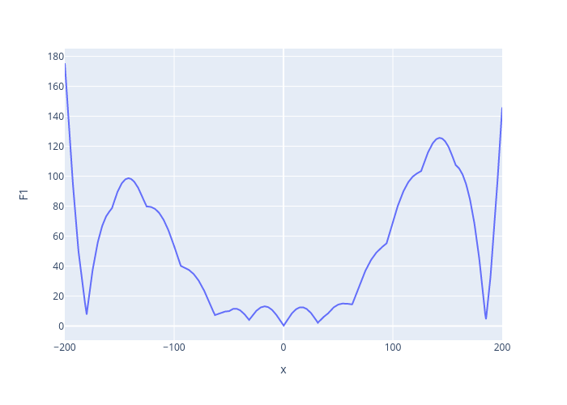

# Trivial single-objective optimization using Ax

To get started with this toolkit, it's important to understand how Ax works. For this,
we will try to fit a Gaussian Process model to the `F1` function from this
[New Benchmark Functions for Single-Objective
Optimization Based on a Zigzag Pattern](https://ieeexplore.ieee.org/stamp/stamp.jsp?tp=&arnumber=9684455)
paper, with parameters `k=1, m=0, lambda=0.01`.

## Prerequisites

- You only need the `foamBO` package: `pip install foamBO`
- No OpenFOAM installation is needed.

## Basic Ax usage

The [case/ax_tutorial.py](case/ax_tutorial.py) file outlines how one would run an Ax experiment to fit
the GP model to this `F1` function given a range of an input parameter.



We opted to use the standard service API of Ax platform which only requires creating
[an experiment object](case/tutorial.py#L30). The [evaluate](case/tutorial.py#L25) function
defines how to run trials and get objective function values.

The optimization is then [ran for a specified number of trials](case/tutorial.py#L47).
The script reports data for tried parameter sets to a CSV file called `trails.csv`:

|     | F1                 | trial_index | arm_name | x1                  | trial_status | generation_method |
|-----|--------------------|-------------|----------|---------------------|--------------|-------------------|
| 0   | 125.5614419218787  | 0           | 0_0      | 142.91234016418457  | COMPLETED    | Sobol             |
| 1   | 137.4746356152921  | 1           | 1_0      | -196.65845893323421 | COMPLETED    | Sobol             |
| 2   | 86.13625438356993  | 2           | 2_0      | -153.54678109288216 | COMPLETED    | Sobol             |
| 3   | 97.58928122008852  | 3           | 3_0      | 165.66546373069286  | COMPLETED    | Sobol             |
| 4   | 41.63246916935881  | 4           | 4_0      | 78.16772572696209   | COMPLETED    | Sobol             |
| 5   | 11.242102443282068 | 5           | 5_0      | 44.21424820034855   | COMPLETED    | GPEI              |
| ... |                    |             |          |                     |              |                   |
| 245 | 104.63036422255719 | 245         | 245_0    | 126.4579027891159   | COMPLETED    | GPEI              |
| 246 | 104.99105611443518 | 246         | 246_0    | 160.75600646436214  | COMPLETED    | GPEI              |
| 247 | 90.05210906614289  | 247         | 247_0    | -151.47976130247116 | COMPLETED    | GPEI              |
| 248 | 1.5850559450163602 | 248         | 248_0    | -1.3231057673692703 | COMPLETED    | GPEI              |
| 249 | 9.791453783394536  | 249         | 249_0    | 42.39068925380707   | COMPLETED    | GPEI              |

The script then tries to predict `F1` values given some values of the input parameter `x` and compare
the predictions to actual computations. Data is emitted to `preds.csv`:

| Prediction | x    | F_pred             | F_sems               | F                  |
|------------|------|--------------------|----------------------|--------------------|
| 0          | -200 | 174.63618741558128 | 0.6329054399290314   | 175.44945250727628 |
| 1          | -170 | 55.266755926407235 | 0.10808701090481283  | 55.23857491879557  |
| 2          | -140 | 98.3580466612992   | 0.11250479400796494  | 98.3580735569487   |
| 3          | -110 | 71.32607111112787  | 0.4734345489330263   | 71.33040206550703  |
| 4          | -80  | 32.788968318866935 | 0.07289129920023037  | 32.78958246623382  |
| 5          | -50  | 9.700431247915049  | 0.12922848535206222  | 9.589242746631385  |
| 6          | -20  | 12.633354784197934 | 0.07806369707714551  | 12.635374268256818 |
| 7          | 10   | 10.209968498988331 | 0.1780045423552858   | 10.210209848078966 |
| 8          | 40   | 7.778538203614069  | 0.11111254989792205  | 7.5680249530792825 |
| 9          | 70   | 28.29979762618629  | 0.053106413737008674 | 28.30486598718789  |
| 10         | 100  | 69.72214774666146  | 0.05616463009040977  | 69.7002111088937   |
| 11         | 130  | 111.92699666311505 | 0.11316781468888545  | 111.92357036826641 |
| 12         | 160  | 105.70483824076317 | 0.03860829383104423  | 105.69503316665066 |
| 13         | 190  | 39.78808635752753  | 0.40179809083014967  | 39.460772096629526 |

## Equivalent foamBO usage

In this section, we'll explain how you would carry out the same optimization using
`foamBO`. For this, we'll need a `config.yaml` and a dummy OpenFOAM case (which has
a single dictionary).

### Configuration and "OpenFOAM" case

The configuration file usually contains four sections `problem`, `meta`, `validate` and `visualize`.
In this example, we can ignore `visualize` as it configures how `foamDash` utility visualizes
the optimization trials and metric evolution.

The first section, `problem`, defines the optimization problem you're treating.
It points to the base OpenFOAM case (`problem.template_case`) and distinguishes between
running "optimiztion" and just "parameter variation" through `problem.type`.

This section also provides users with the ability of choosing generation models (`problem.models`).
Here we are using `auto` to let Ax algorithms decide on those models.
```yaml
problem:
  name: SingleObjF1
  template_case: 'case'
  type: 'optimization'
  models: auto
```

As an example, to run `SOBOL` for 5 trials and then `GPEI` for 20, we could:
```yaml
problem:
  models:
    SOBOL: 5
    GPEI: 20
```

The `problem` section also defines optimization parameters (`problem.parameters`),
how to substitute them in the OpenFOAM case (`problem.scopes`), and how to
treat optimization objective functions (`problem.objectives`).

In this case, we have only one parameter, which we call `x`. We substitute its chosen
value inside `case/FxDict` dictionary at the `x` keyword.

The objective function (which is still F1 from the previous section) is computed by
calling [case/benchmark.py](case/benchmark.py) with specific arguments. Note that
the `benchmark.py` script needs to read the parameters from the OpenFOAM case; which
doesn't require an OpenFOAM installation as it uses `PyFoam`.

```yaml
problem:
  parameters:
    x:
      type: range
      value_type: float
      bounds: [-200, 200]
      log_scale: False
  scopes:
    "/FxDict":
      x: "x"
  objectives:
    F1:
      mode: 'shell'
      command: 
        - 'python3'
        - 'benchmark.py'
        - '--F'
        - 'F1'
        - '--k'
        - '1'
        - '--m'
        - '0'
        - '--lb'
        - '0.01'
      threshold: 80
      minimize: True
      lower_is_better: True
```

It's also important to specify which cases files/folders are copied when generating
the trials as PyFOAM, by default, only copies standard directories (`0`, `system` and `constant`).

The rest of `meta` settings are straightforward and self-explanatory:
```yaml
meta:
  case_subdirs_to_clone:
    - FxDict
    - benchmark.py
  clone_destination: "./trials/"
  case_run_mode: local
  case_run_command: ['echo', '0']
  metric_value_mode: 'local'
  n_trials: 300
  n_parallel_trials: 5
  ttl_trial: 3600
  init_poll_wait: 0.1
  poll_factor: 1.5
  timeout: 10
  use_saasbo: False
  n_pareto_points: 5
  stopping_strategy:
    improvement_bar: 1e-4
    min_trials: 100
    window_size: 10
```

Note that, in particular, `meta.use_saasbo` will try to use Fully Bayesian SAASBO if `auto` is passed
to `problem.models`.

As for the OpenFOAM [case](case), you can simply a single dictionary [case/FxDict](case/FxDict) with
the content:
```cpp
x 0;
```

After the optimization has gone through all of its trials, you can run the `validateBO` command
to run some validation routines on the surrogate model. The `validate` section configures
how to perform the validation:

> It's important not to change the `config.yaml` between running `foamBO` and `validateBO`

```yaml
validate:
  cross_validate: True # Run Ax's cross validation (doesn't run new trials)
  # if no "trials" and no "pareto_frontier" is present, on the cross-validate from Ax
  # will run
  trials: # The utility w
    - x: 0.2
    - x: 1.0
    - x: -100
  # IF it's a multi-objective optimization, you can generate 10 pareto frontier points
  # and run them to check how the close the prediction is to the actual metric values
  #pareto_frontier: 10
  #primary_objective: "metric_1"
  #secondary_objective: "metric_2"
```

The `validateBO` will run the trials using the same configuration used to run the experiment's trials,
and will result in a CSV file `Validate_<cfg.problem.name>_validate_report.csv` which has the required
data to perform validation analysis.

### Generating predictions from models trained with foamBO

`foamBO` will periodically save your experiment to a JSON file, and once the optimization is
stopped, it will write its current state to another JSON. You can load those again into an Ax client:
```python
# You need to load stuff from core.py to be able to de-serialize the custom runners, metrics, ... etc
from foambo.core import *
from ax.service.ax_client import AxClient
from ax.storage.json_store.load import load_experiment
cl = AxClient().load_from_json_file('SingleObjF1_client_state.json')
exp = load_experiment(f"SingleObjF1_experiment.json")
cl._experiment = exp
cl.get_model_predictions_for_parameterizations([{'x': 100}, {'x': -50}])
```
This then should result in very similar results to what `tutorial.py` reports.
